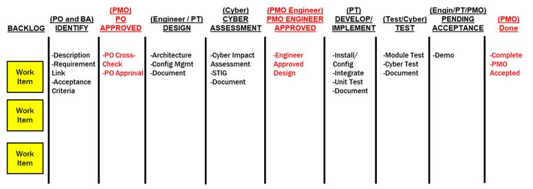
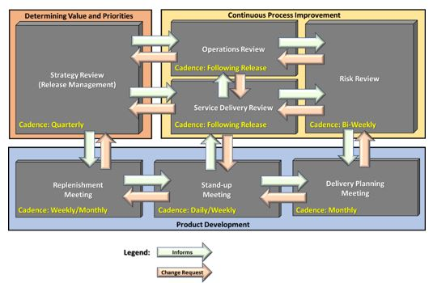

> # **5.3** Kanban

Considerations for establishing a Kanban process:

- Establish the Kanban Board - Visualize the workflow to organize, optimize, and track the work item development progress (allows for transparency of status)
- Limit Work in Progress (WIP) - Kanban is about flow. The more items in progress, the more risk of nothing getting done. It is better to have a limited WIP
  that emphasizes the Lean pull system. That is, when a resource has completed work on a work item and moved it to the next column, s/he pulls the next work item from
  the column before it. A starting rule for each policy column is limit WIP to amount of column resources + 1 (i.e. for a development column - the WIP would be the
  number of developers on the team plus one - that allows for a developer who hits an impediment to stop work on that work item and pull another one from those completed
  in the previous column while the Agile Lead works to remove the impediment. This allows for the flow to continue).

Key points in Kanban:

- Minimize Lead Time (the time a work item is in any specific stage / column)
- Minimize Cycle Time (the time for the entire work flow cycle to complete for a single work item) - since establishing a cycle time allows for estimation of
  work items, but not all work items are the same complexity - one methodology for differentiating the work item complexity is to provide multiple swim lanes for
  tracking work progress -
- One for work items which have an expected cycle time of 1 week
- One for 2-week items
- One for 1-month items
- Optional - an expedited swim lane (similar to the express lane at a supermarket) for high-priority work items that should take precedence over all others
  (this will be mentioned again as a strategy for using Kanban to manage Operations and Maintenance work items)
- Manage flow - The Agile Lead works with the development team to ensure that workflow issues are identified and resolved (i.e. if there is a backup in the
  workflow, an additional resource may be needed to relieve pressure on the bottleneck column)
- Make process policies explicit - Each column on the Kanban Board should have an explicit policy which indicates when the work in that column is complete
  (policy = that column's "Definition of Done")
- Improve the process - In collaboration between the development team and PMO - there should be a focus on continuous improvement of the process (re-define
  the policies, determine whether columns should be added, determine whether columns should be deleted)

While Scrum focuses on a cross-functional team, Kanban focuses more on aligning the resources with the policies. A simple representation of a Kanban Board
(this also provides a quick start-up template for HIA products) is:

Templated steps / policies for an initial Development Team Kanban board:

1. **Backlog**: PMO PO prioritizes the Work Items in the Backlog 
2. **Identify**: Development Team Business Analyst in coordination with the PMO PO will identify / refine the description and acceptance criteria for the work
   item 
3. **PO Approved**: PMO PO will approve the description and acceptance criteria (Confirms that the work meets functional requirements - think mini-PDR) 
4. **Design**: Development Team's Senior Developer will complete draft solution design 
5. **Cyber Assessment**: Developer's cybersecurity representative (ICW PMO Cybersecurity) will complete security assessment of solution 
6. **PMO Engineer Approved**: PMO Engineer will approve design of solution (Confirm that solution meets technical requirements - think mini-CDR) - work item now
   "ready" for development. 
7. **Develop / Implement**: Developers implement the solution 
8. **Test**: Development team testers and cybersecurity will conduct testing and update documentation as needed 
9. **Pending Acceptance**: Development team will demonstrate completed work item functionality to PMO 
10. **Done**: PMO will accept work item as complete (meets the Definition of Done) 

An Operations and Maintenance team provides an example of a project built for Kanban. The backlog would contain the ticket items requiring resolution with the
priority of work established by a government Product Owner. This approach allows refinement of last minute prioritized work items identified by system users through
the workflow's column policies identified above (the process of making the work item "ready" is captured within the workflow). Also, if the Kanban board swim lanes
are setup as described above, the board will contain an expedite lane for flowing through critical fixes requiring short duration resolution. (Note: Another example
would be the cybersecurity team handling the implementation of required TCNO/IAVAs.)

### 5.3.1 Kanban Cadences

While Scrum Events focus on execution of the time-boxed process, the key Kanban events (cadences - named for their formal rhythm) focus on organizing, optimizing,
and tracking the development process. The cadences indicated below are interdependent as represented in the figure above - some meetings inform others, while feedback
from other meetings drive changes to the process.

**Strategy Review (Release Management)** - Are the Backlog priorities still correct? Is the Release Roadmap up to date?

- Play: Link to Play below in the Appendix
- Overview: A Strategy Review session is held to periodically review the current status of the development effort as well as revise the Release Roadmap to ensure
  that it correctly reflects current value and priorities. The question answered during this meeting is: Are we doing the right thing? The Release Management process
  described before represents an example of the events and timelines reflected within this cadence.
- **Example cadence**: Quarterly or based on release period - should look at current and next release and how the PB reflects that plan / strategy.

**Stand-ups** - Focused on the Kanban board and managing workflow

- Play: Link to Play below in the Appendix
- Overview: While the focus of the Scrum stand-up meeting is on the individual work and how it relates to the team's ability to meet sprint (time-boxed) goals
  (What did I do yesterday? What will I do today? What is impeding my work?), the focus of the stand-up for Kanban is managing the flow of work items among the
  Development Team resources to make it as efficient as possible (managing workflow to minimize the time any piece of work is in any stage of development). While the
  stand-up can be done daily, it is not a requirement of Kanban as the trigger for work to be pulled into the next column is automatic (completion of the column policy
  for that work item and next column resource availability). The cadence recommendation of a week is a goal - the team will most likely start out in a daily cadence
  until the workflow is better understood.
- **Example cadence**: Initially daily. Can evolve to once a week to coordinate the efforts of the team and resolve work-in-progress bottlenecks.

**Replenishment Meeting** - Similar to the Sprint planning sessions - these meetings ensure that the work items which will be brought into the development stream are prioritized and "ready" to be worked on.

- Play: Link to Play below in the Appendix
- Overview: The replenishment meeting ensures that there is "ready" work prioritized in the backlog to be brought into the workflow. The battle rhythm for when
  these meetings are necessary are dependent on the workflow (the recommendation is to start by having this monthly and then determine whether it should happen more or
  less often). It should take the work that the government has identified (refined down to the work item level) and ensure that the work is "ready" to enter into the
  workflow. It is the last step in determining which prioritized work is up next and ensuring that the work still adds value to the government.
- **Example cadence**: Once every month (or as necessary to ensure that there is a "ready" backlog of work to feed the development stream).

**Delivery Planning Meeting** - This meeting coordinates product hand-off based on current work delivered between multiple entities: Developers, Product Owners,
Testers, Trainers, Users (can be facilitated with establishment of Continuous Delivery process and structure).

- Play: Link to Play below in the Appendix
- Overview: The Delivery Planning meeting is a discussion between multiple entities of the results of the actual workflow (while the Strategy Meeting
  establishes a plan, the Delivery Planning Meeting looks at the reality). An assessment is made of the Kanban board to determine what work in progress will be
  completed by a specific time to pass it on to the next entity in the chain. It is about establishing expectation management so that external agencies can plan for
  events which are dependent on the contents of the delivery. These include: - PMO ensuring that reviewers are ready to conduct the Physical Configuration Audits and appropriate document reviews, - The LDTO agency coordinating testing events based on specific RALOT. - Users providing timely feedback; - Functionals coordinating training events so that released functionality into production can be used.
- **Example cadence**: Once every month to update downfield receivers of the product (highly dependent on the release timeline - i.e. a release once a quarter
  might only require this meeting once a quarter).

**Operations Review** - How do we improve the process from the organization's point of view

- Play: Link to Play below in the Appendix
- Overview: This review is similar to a Scrum retrospective (how to improve the process) but looks at the release management system from an organizational point
  of view. It looks at improving the entire system as it relates to incorporating the Kanban team workflow methodology into the government review and release system.  
  While the Delivery Planning Meeting focuses on coordinating the efficient release of the product, this meeting is about improving the release process based on lessons
  learned. It looks back on each release from the perspective of all stakeholders to continuously improve the system for the next release.
- **Example cadence**: Once every 3 months (or by exception) following the Release Delivery

**Service Delivery Review** - Review of the release product from the user's point of view.

- Play: Link to Play below in the Appendix
- Overview: This review is conducted to determine if the items being produced are actually meeting the user's needs. The Service Delivery Review focuses on what
  was produced from the end-user's point of view and whether it fulfills their functional needs as well as quality standards. It provides a direct feedback chain from
  the end user to allow the PMO PO insight into requirement and prioritization changes, as well as the development team to understand better how their product is being
  viewed by the users of the system (including their satisfaction and concerns).
- Example cadence: Once every 3 months (or by exception) following the Release Delivery. Frequency will vary based on user first look events or actual releases
  to the field - need to provide end-user enough time to review delivered product.

**Risk Review** - Done as necessary to review all identified risks to determine the status of risk mitigation measures and issue / impediment resolution.

- Play: Link to Play below in the Appendix
- Overview: The Risk Review discusses the probability and impact of planning assumptions being wrong and what steps the PMO and development team are taking to
  minimize those risks. It focuses on what steps are being taken to minimize the probability of false assumptions impacting delivery cost or schedule. This review
  focuses on reduces uncertainties in the system in order to establish predictability and reliability in the system which enables trust to form within the different
  organizational entities including the PMO, development team, external testers, users, etc.
- **Example cadence**: Once every 2 weeks (or combined with PMO Risk Management Meeting)
