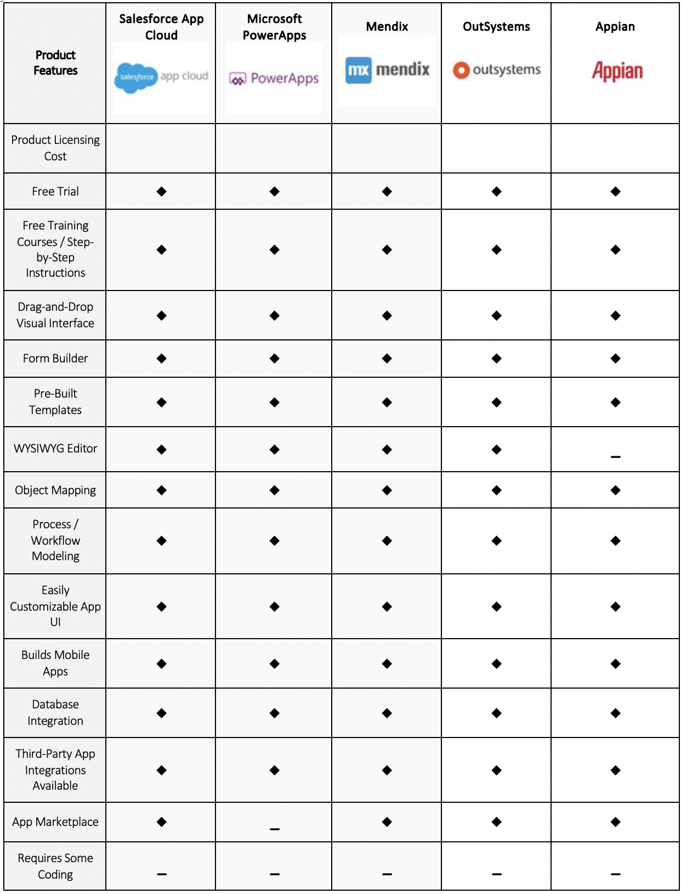
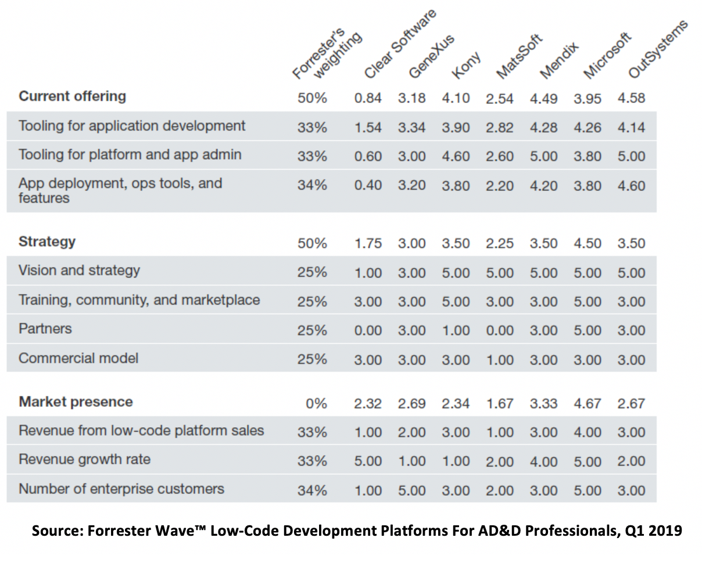
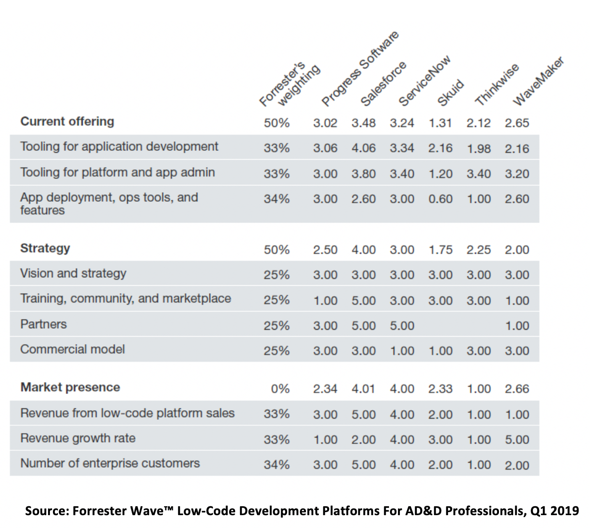

> # **7.0** Appendix B – Low-Code Platform Evaluation Template

PCMag, Gartner and Forrester Low-Code evaluation templates were selected as representative of best practices in Low-Code test and evaluation and to avoid re-inventing the wheel. In addition to market assessments, Gartner provides customer reviews; for example see: https://www.gartner.com/reviews/market/enterprise-high-productivity-application-paas/compare/salesforce-vs-microsoft. 

## 7.1 Evaluation Templates

### PCMag

A product features trade-off matrix (see table below) is used by PCMag to evaluate the Low-Code Development Platforms they tested. We selected the top 5 vendors for evaluation side-by-side using the PCMag trade-off matrix.

__
__

### Forrester WaveTM 

Evaluation Templates are excerpted from the Forrester Wave™ Low-Code Development Platforms For AD&D Professionals, Q1 2019, by John R. Rymer and Rob Koplowitz, March 13, 2019. Please see the excerpted template charts presented below. Refer to the full report for the rich details it contains.

__

__

### Gartner

The Gartner Magic Quadrant evaluation criteria evaluation templates are extensive: The following evaluation criteria were excerpted from Magic Quadrant for Enterprise High-Productivity Application Platform as a Service, published 26 April 2018, by Analysts Paul Vincnet, Van Baker, Yefim Natis, Kimihiko IiNima, Mark Driver, Rob Dunie, Jason Wong, and Aashish Gupta. Please refer to the full report for the rich details it contains in the evaluation templates.

## Evaluation Criteria

### Ability to Execute

Vendors in Magic Quadrants are evaluated on two axes: Ability to Execute and Completeness of Vision. These relate to their performance in the year and our research (2017 in this case, because this research began in September 2017) and their vision for the following years. Vendors are scored according to the Gartner methodology for Magic Quadrants and these scores define each vendor's position. In each successive year, the evaluation criteria are changed as new technologies are defined, new markets addressed and new roadmaps created. Vendors are invited to provide the data for the evaluation criteria via questionnaires and briefings, but evaluations also include the results of Gartner customer surveys and analyst information from client inquiries.

#### Table 1: Ability to Execute Evaluation Criteria

| Evaluation Criteria          | Weighting |
| ---------------------------- | --------- |
| Product or Service           | High      |
| Overall Viability            | Medium    |
| Sales Execution/Pricing      | High      |
| Market Responsiveness/Record | Medium    |
| Customer Experience          | High      |
| Operations                   | Medium    |

_Source: Gartner (April 2018)_

To evaluate the Customer Experience criterion, Gartner confidentially surveyed vendor-supplied reference customers. At least seven references were required for the survey data to be considered for discussion in the Magic Quadrant. While insights from references may not be statistically significant, they are useful as feedback from vendors' customers.

### Completeness of Vision

Gartner analysts evaluate technology providers on their ability to convincingly articulate logical statements about current and future market direction, innovation, customer needs and competitive forces, and how well they map to the Gartner position. Ultimately, technology providers are rated on their understanding of how market forces can be exploited to create opportunity for the provider.

#### Table 2: Completeness of Vision Evaluation Criteria

| Evaluation Criteria         | Weighting |
| --------------------------- | --------- |
| Market Understanding        | High      |
| Marketing Strategy          | High      |
| Sales Strategy              | Medium    |
| Offering (Product) Strategy | High      |
| Business Model              | Low       |
| Vertical/Industry Strategy  | Low       |
| Innovation                  | High      |
| Geographic Strategy         | Medium    |

