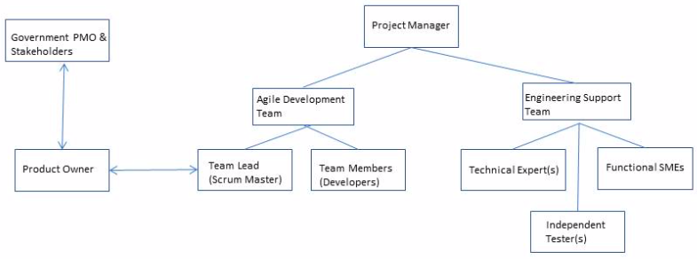
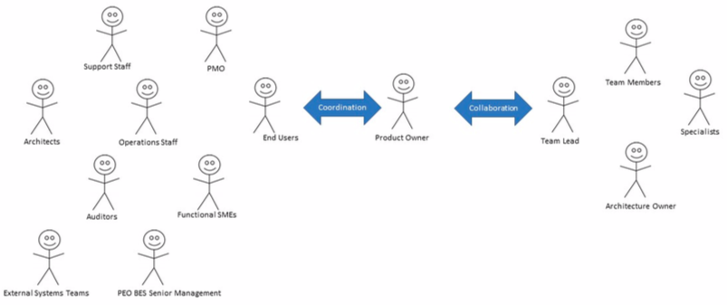

> # **6.1**  Project Team

AAM Agile project teams are formed from development specialists who are cross-trained on one or more technical specialties (e.g. system architecture, cybersecurity, automated code transformation, Java programming, SQL database development, continuous integration, automated testing ...) so that they can contribute to the team and they also have a general knowledge of the business domain in which they work. Agile teams are stable and program management understands that changing team structures; for example, this iteration Jeff is part of the development team but next iteration Jeff's pulled off to help another team, is detrimental to project success. Program Managers strive to keep teams as stable as possible.

## 6.1.1 Small Agile Project Teams

**Figure 5-3** overviews the structure of a small AAM agile team best suited for re-hosting (transform lite, lift and shift) projects. The Project Management leadership team and a team of developers, led by the team lead, works closely with a government PMO product owner and stakeholders to build high-quality working system features using iterative sprints with support on a just-in-time basis from the Engineering Support team members.

**Figure 5-3. Small agile Team organization Structure**

The small agile project team common agile roles are:

**Project Manager:** on agile team projects, the project manager’s tasks include: Project financials; Assessment, Measurement and Status reporting; Project governance; Change management;  Identification of missing roles and/or resources; Business stakeholder communication; Risk communication and management; Project planning and scheduling and Quality Assurance.

**Development Team:** There are several roles on the development team, which have different names depending on the methodology being followed, common to agile teams. Roles are not positions; any given person takes on one or more functional roles and can switch roles over time. The common agile development team roles are:

- **Team lead/architecture owner.** This role, called “Scrum Master” in Scrum or team coach or project lead in other methods, is responsible for facilitating the team, obtaining resources for it, and protecting it from problems. This role encompasses the soft skills of project management but not the technical management ones such as: project planning, project assessment and control, decision management, measurement and quality assurance activities which are better left to the project manager as described above.

- **Team member.** This role, sometimes referred to as developer or programmer, is responsible for the creation and delivery of a system. This includes requirements, business analysis, design, programming, automated code transformation, code refactoring, testing, and release implementation activities, as well as others.

- **Product Owner.** The product owner represents the government stakeholders and provides the voice of the users. This is the one person who is responsible for a release prioritized work item list (called a product backlog in Scrum), for making decisions in a timely manner, and for providing information in a timely manner. The range of stakeholders a product owner represents is depicted in **Figure 5-4** and is scaled to the AAM project size.

- **Stakeholder.**  A stakeholder is anyone who is a direct user, indirect user, manager of users, senior manager, operations staff member, the "PMO" who funds the project, support (help desk) staff member, auditors, program/portfolio manager, and developers working on other systems that integrate or interact with the one under development, or maintenance professionals potentially affected by the development and/or deployment of a software project.

**Figure 5-4. Product Owner Represents a Large Range of Stakeholders.**

**Engineering Support Team:**  The development team often requires technical specialists to help modernize, design, transform, build and refactor applications. The common Engineering Support Team roles are: 

- **Technical experts.** The agile team needs the help of technical experts, such as: enterprise architects; cybersecurity engineers for RMF processes and cybersecurity static and dynamic application security testing; automated code transformation specialists; DBA’s for database design; DevSecOps for CI/CD infrastructure and software builds; configuration management specialists to maintain CM, code version control and artifact repository; and automated testing experts to build test scripts. Technical experts are brought in on an as-needed, temporary basis, to help the team and to transfer their skills to one or more developers on the team.

- **Functional SME experts.** The product owner represents a wide range of stakeholders (see **Figure 5-3**), not just end users, and in practice it isn't reasonable to expect them to be experts at every single nuance in the business or mission domain. As a result the product owner will sometimes bring in Functional SMEs to work with the team, perhaps a supply expert to explain the details of a requirement or the sponsoring executive to explain the vision for the project.

- **Independent tester.** Effective agile teams often have an independent test team working integral to the team or in parallel that implements automated testing frameworks and automated testing tools and verifies and validates the agile development team’s work throughout the development life cycle.

### 6.1.2 Large Agile Project Teams

When the size of an AAM agile development team gets to be more than twenty, which may be required for a complex re-platform (transformation and refactor) project, program/project managers need to take a “team of teams” approach. The strategy is to organize the larger team into a collection of smaller teams organized around the architecture of the system. Each subteam is responsible for one or more subsystems, enabling them to work as a small agile team responsible for delivering working software on a timely basis. **Figure 5-5** describes the organization of large agile teams.

**Figure 5-5. Large agile Project Team**

The additional roles on agile teams at larger scale include:

**Architecture owner.** This person is responsible for facilitating architectural decisions on a sub-team and is part of the architecture owner team which is responsible for the overall architectural runway direction of the project. The architecture owner leads their sub-team through initial architecture envisioning for their sub-systems and will be involved with the initial architecture envisioning for the system as a whole (as part of the architecture owner team, see description of activities below). Architecture owners are different than traditional architects in that they are not solely responsible for setting the architectural direction but instead facilitate its creation and evolution.

**DevSecOps integrator.** The AAM agile subteams are typically responsible for one or more subsystems (i.e. applications modules and the database), and the larger the overall team generally the larger and more complicated the system being built. In these situations the overall AAM team assigns a DevSecOps Engineer in the role of integrator who is responsible for building the Development, Test, Staging and Production environments for the various subsystems. DevSecOps Engineers work closely with the internal or independent test team, who perform system integration and cybersecurity testing regularly throughout the project. As **Figure 5-5** indicates, on large agile teams the Leadership Team needs to provide project governance and coordinate several critical activities:

- **Scaled up Project management activities.** At scale it isn’t sufficient to simply focus on a project leadership team and allow self-organization to address the technical aspects of project management. This may work on the individual subteams, but across the entire program/project the technical aspects of project management, such as dependency management, contract management, resource tracking, and vendor management become critical. The program/project management team of Large AAM Agile Project Teams (**Figure 5-5**) is comprised of the team leads from the various subteams. Their goal is to coordinate the management aspects of the overall team. This team holds a short coordination meeting each day, referred to as a “scrum of scrums” in the Scrum methodology, where current status is shared among the subteams and issues are identified.

- **Technical/architectural activities.** The architecture ownership team is comprised of the architecture owners from the subteams and is responsible for architecture envisioning at the beginning of the project to identify the initial technical direction and provide a basis for organizing the subteams. In the first week of the project (sometimes several weeks on more complex projects) their goal is to identify the subsystems and their interfaces, a strategy called “Vision and Product Portfolio Management” which results in the development of the Architectural Runway. The Architectural Runway is the existing code components and technical infrastructure needed to implement near-term features without excessive redesign and delay. The purpose of the Architecture Runway is to reduce the coupling between subsystems and thereby reduce the amount of coordination required by subteams. Once the architectural layers and interfaces are well defined it is possible for the individual subteams to focus on implementing the AAM project applications of those subsystems. Enterprise Architects define architecture at the Portfolio Level, while at the subteam level, System and Solution Architects/Systems Engineering typically define architecture at the Program and Large Solution levels. The architects help provide the guidance needed to support the analysis, estimation, and implementation of the affected elements—subsystems, components, functions, protocols, internal system functions—to have the architecture necessary to support the near-term features and capabilities on the Product Roadmap. Throughout the project the architecture team will meet on a regular basis to share ideas and resolve technical issues, particularly those surrounding changes to the interfaces of subsystems. They may choose to meet daily, this is particularly common at the beginning of the project, but as the architecture stabilizes it is common to see them meet once or twice a week.

- **Requirements/product ownership activities.** The product ownership team is comprised of the product owners of each subteam and is responsible for coordinating the requirements effort across the subteams. They will need to negotiate requirements with the larger body of stakeholders whom they represent and apportion the requirements items among the subteams product backlogs appropriately. They’ll also need to negotiate the inevitable disputes between subteams as to who should do what and what a requirement actually means. They also manage the requirements dependencies between subteams and strive to minimize overlapping work between subteams.

- **System integration activities.** System integration is important for any size of project team, but it is often absolutely critical on large AAM agile project teams (which often address complex problems). The complexities of large projects often necessitate the addition of a DevSecOps Engineer to the team to configure, build, integrate and manage the CI/CD pipeline Development, Test, Staging and Production infrastructure environments which may be on-premises or cloud-based. System integration occurs throughout the entire agile life cycle, not just at the end of the project during the system integration test phase of a traditional project.
