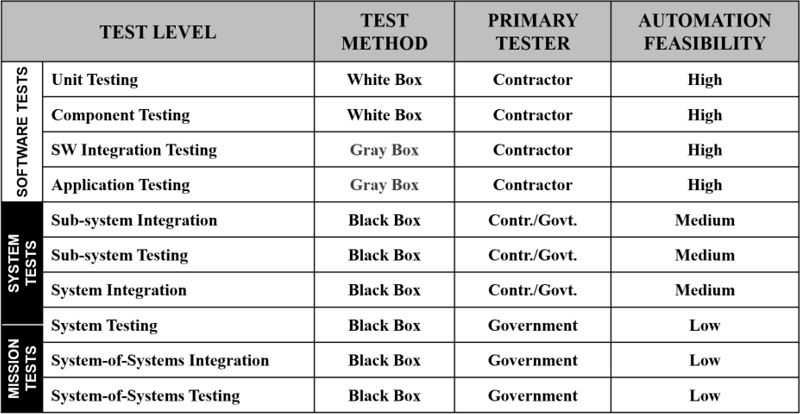

> # **4.2** Test Levels

Government systems cover a broad range of testing levels. Some of these are contractor-focused test deliverables. Others are joint contractor-government, 
and yet others are government-only tests. Automation can be used at many test levels but provides greater value at lower levels. The following table summarizes 
the test levels, methods, role, and feasibility of automation:

### White Box
White Box texting defines a testing approach that provides visibility to the program code as part of the test event. This allows the tester to understand the 
underlying structure of the software system or component under test. Testing at this level exposes design and implementation methods (and potential flaws) used 
to construct the software. The goal to understand and validate the individual lines of code, to the extent possible. Software construction with excessive levels 
of branching or nesting often cannot be easily tested.

### Black Box
Black Box testing defines an approach to testing that focuses on the functionality of the software under test. The tester exercises the software much as a user 
would interact with the software and thus attempts to validate if the expected features and functionality have been properly implemented, based on a 
specification or user story. This technique complements the White Box approach as the system is tested from two different perspectives.

### Gray Box
Gray Box testing combines elements of White and Black Box testing in order to simultaneously identify any defects in application usage that are due to poorly 
implemented coding constructs.

### Feasibility of Automation

#### Software Tests

Automation is generally easier to implement earlier in smaller, contained, software components. Developers can make good use of automation to test incremental 
code updates, functions, and components. There are many tools for developers that not only automate test execution but that also provide assessments of the code 
quality and complexity. These should be run first while modules are still manageable rather than when software has been integrated and combined with other systems, 
where analysis becomes much more difficult on a significantly larger code base.

#### System Tests

Automated system tests verify and validate system behavior. Although there may be some reuse from automation at the earlier software test level, system tests 
by and large are Black Box tests where the activity is focused on functional requirements that the software must meet. Often these will focus more on testing 
the system through interfaces (graphical user interface, API, etc.).

#### Mission Tests

As the system grows and becomes integrated with other systems, automation can still play a part. For example in a System-of-Systems test automation can be used 
to drive the individual subsystems comprising the System-of-Systems solution. This automation solution will help coordinate or synchronize the execution of various 
systems under test. However, this is a broad vs deep application of test automation, as it pertains to functionality.

Finally, as systems are migrated to a production environment we lose the ability to test and automate.
